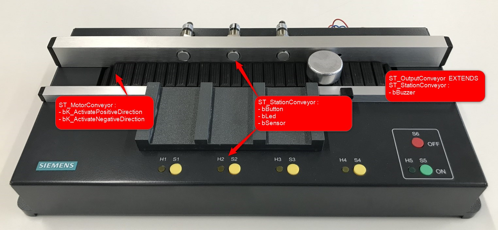
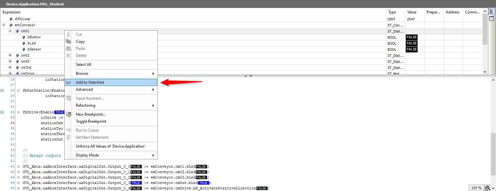
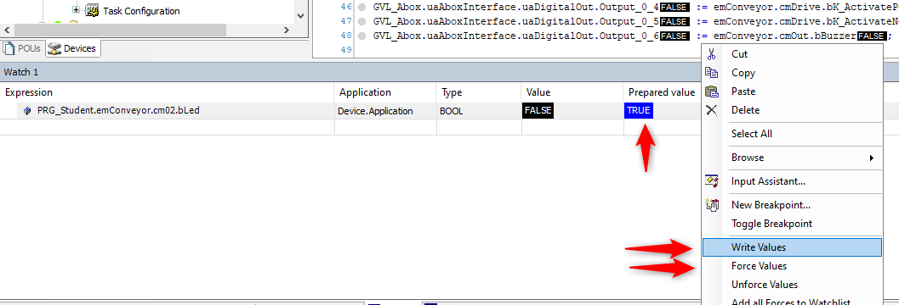
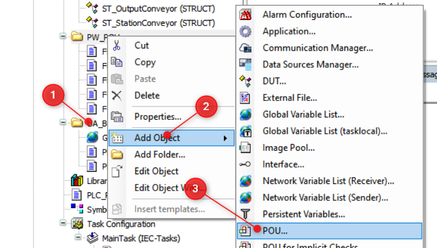

<h1 align="left">
  <br>
  
  <br>
  HEI-Vs Engineering School - Industrial Automation Base
  <br>
</h1>

Cours AutB

Author: [Cédric Lenoir](mailto:cedric.lenoir@hevs.ch)

> Version 2025, Version 1.0

# LAB 02 Strukturierte Programmierung eines Förderers

# Vorwort

Aus historischen Gründen verwenden wir die SPS im ctrlX Core für die Programmierung und die Siemens S7 SPS für die Kommunikation mit den Ein- und Ausgängen. Das ist nicht unbedingt sehr praktisch, entspricht aber auch der Realität in der Industrie. Es ist selten, dass man das Glück hat, eine neue Anlage oder eine neue Maschine zu entwerfen und dabei die Vergangenheit außer Acht zu lassen.


Die Siemens-SPS schreibt ihre Eingaben auf globale Variablen im ctrlX und liest die globalen Ausgabevariablen, um sie an die Aktoren zu senden.

Alle Ein- und Ausgänge sind im ctrX Core über die globale Struktur: ``GVL_Abox.uaAboxInterface`` verfügbar.


# Ziele
- Eine Datenstruktur programmieren, um die Ein- und Ausgänge eines Förderbandes zu vernetzen.
- Mehrere POUs (Program Organization Unit) strukturiert programmieren, um einen Förderer zu steuern.


Es gibt Standards, die Strukturen für Maschinen in der Industrie festlegen. Der Sinn dieser Strukturen besteht darin, die Wiederverwendbarkeit des Codes über mehrere Projekte hinweg zu erleichtern. Wir stützen uns hier auf den ISA 88-Standard.

- Der Förderer wird als **Equipment Module** definiert.

- Das Förderband besteht aus mehreren **Control Modules**.

- Ein **Control Module** ist das kleinste Modul, das im Standard **ISA 88** definiert ist.

- Ein **Equipment Module** besteht aus mehreren **Control Modules**.

- Eine Maschine, **Unit**, besteht aus mehreren **Equipment Modules**.

Wir betrachten hier unser Förderband als Teil einer Maschine, **Unit**. 
*Die Maschine kann selbst Teil eines Maschinensatzes sein*.


 <figcaption>Unit based on S88</figcaption>


<br>

# <u> Erster Schritt </u>

## Ziele:
Programmieren von **DUT** (Data User Type) in Form von Datenstrukturen, die es ermöglichen, mehrere Variablen (die aus verschiedenen Datentypen bestehen können) in einer logisch zusammenhängenden Einheit zusammenzufassen.


<figcaption>Datenstrukturen des Förderers</figcaption>


<br>

<u>Hinweis </u>: ST_StationOutput „erbt“ von ST_StationConveyor.


<br>

<figure>
    
    <figcaption>Datenstrukturen des Förderers</figcaption>
</figure>


<br>


## Wie fügt man einen DUT (Data User Type) hinzu?
<figure>
    
    <figcaption>Hinzufügen eines DUT (Data User Type)</figcaption>
</figure>


<br>

# <u> Zweiter Schritt </u>

## Ziele:
- Erstelle eine Instanz der Datenstruktur ``ST_Conveyor`` im Programm ``PLC_PRG`` und vervollständige das Programm, um die Ein- und Ausgänge des Förderers mit dieser Instanz zu verknüpfen.
- Überprüfen Sie, ob die Ein-/Ausgänge des Förderers funktionieren.

<br>

<u>Hinweis </u>: Die Datenstruktur ``GVL_Abox.uaAboxInterface`` stellt die Schnittstelle zu den Ein- und Ausgängen der SPS dar.

<br>

Vervollständige dein Hauptprogramm ``PLC_PRG``, indem du dich auf das folgende Beispiel beziehst.


```iecst
PROGRAM PLC_PRG
VAR
	diMyLoop		: DINT;
	emConveyor		: ST_Conveyor;  // Your structure
END_VAR
//
// Manage inputs
//
// cm01
emConveyor.cm01.bButton := GVL_Abox.uaAboxInterface.uaDigitalIn.Input_0_0;
// other inputs

//
// Code
//

//
// Manage outputs
//
// cm01
GVL_Abox.uaAboxInterface.uaDigitalOut.Output_0_0 := emConveyor.cm01.bLed;
// Other outputs
```


<br>


## PLC Tags, SDS, Software Design Specification
|Siemens Address|Data Type|ctrlX Global Var Struct                         |Hardware on conveyor|
|---------------|---------|------------------------------------------------|--------------------|
|%I0.0          |BOOL     |GVL_Abox.uaAboxInterface.uaDigitalIn.Input_0_0  |Push Button S1      | 
|%I0.1          |BOOL     |GVL_Abox.uaAboxInterface.uaDigitalIn.Input_0_1  |Push Button S2      | 
|%I0.2          |BOOL     |GVL_Abox.uaAboxInterface.uaDigitalIn.Input_0_2  |Push Button S3      | 
|%I0.3          |BOOL     |GVL_Abox.uaAboxInterface.uaDigitalIn.Input_0_3  |Push Button S4      | 
|%I0.4          |BOOL     |GVL_Abox.uaAboxInterface.uaDigitalIn.Input_0_4  |Sensor Active B1    | 
|%I0.5          |BOOL     |GVL_Abox.uaAboxInterface.uaDigitalIn.Input_0_5  |Sensor Active B2    | 
|%I0.6          |BOOL     |GVL_Abox.uaAboxInterface.uaDigitalIn.Input_0_6  |Sensor Active B3    | 
|%I0.7          |BOOL     |GVL_Abox.uaAboxInterface.uaDigitalIn.Input_0_7  |Sensor Not Active B4| 
|%Q0.0          |BOOL     |GVL_Abox.uaAboxInterface.uaDigitalOut.Output_0_0|Led H1              | 
|%Q0.1          |BOOL     |GVL_Abox.uaAboxInterface.uaDigitalOut.Output_0_1|Led H2              |
|%Q0.2          |BOOL     |GVL_Abox.uaAboxInterface.uaDigitalOut.Output_0_2|Led H3              |
|%Q0.3          |BOOL     |GVL_Abox.uaAboxInterface.uaDigitalOut.Output_0_3|Led H4              |
|%Q0.4          |BOOL     |GVL_Abox.uaAboxInterface.uaDigitalOut.Output_0_4|Contactor K1        |
|%Q0.5          |BOOL     |GVL_Abox.uaAboxInterface.uaDigitalOut.Output_0_5|Contactor K2        |
|%Q0.6          |BOOL     |GVL_Abox.uaAboxInterface.uaDigitalOut.Output_0_6|Buzzer A1           |

<br>

## Visualisierung von Programmdaten


Die Verarbeitung eines Programms auf einer Steuerung ist zyklisch. **Eine Step-by-Step-Analyse ist in der Regel nicht möglich**.

> Der einfache Zugriff auf die Daten während des Programmablaufs ist von entscheidender Bedeutung.

> Der Datenzugriff muss bereits in der Entwurfsphase des Programms berücksichtigt werden.

<br>

### Steuerung des Förderers im manuellen Modus mit dem „Watch“-Tool
In jeder SPS-Entwicklungsumgebung (IDE: Integrated Development Environment) gibt es die Möglichkeit, Variablen anzuzeigen und zu erzwingen..


<br>

Überprüfen Sie mithilfe des „Watch“-Tools, ob die Ein- und Ausgänge des Förderbands funktionieren.

<br>

<u> Vorgehensweise </u> :

### 1. ein „Watch“-Fenster öffnen

<figure>
    
    <figcaption>ein „Watch“-Fenster öffnen</figcaption>
</figure>

<br>

### 2. Wählen Sie das gewünschte Element aus.
Sie können jedes Element auswählen, das instanziiert wurde, d. h. eine Variable, eine Struktur oder einen Funktionsblock.

<figure>
    
    <figcaption>Ein Element in einem „Watch“-Fenster hinzufügen</figcaption>
</figure>

<br>

### 3. Element ansehen/forcieren

<figure>
    
    <figcaption>Ein Element in einem „Watch“-Fenster ansehen/forcieren</figcaption>
</figure>


<br>

<u>Kurzbefehle </u> : 
Zum Forcieren --> [F7]
Zum Schreiben --> [Ctrl + F7]


<u> Hinweis</u>: 

**Eine Variable forcieren** bedeutet, dass Sie einer Variablen einen bestimmten Wert aufzwingen, unabhängig davon, was das Programm vielleicht versucht, ihr zuzuweisen. Einmal erzwungen, behält die Variable diesen Wert, bis Sie sie aus der Forcierung entlassen. Dies ist nützlich für Tests und Debugging.

**Eine Variable schreiben** bedeutet einfach, einer Variablen im normalen Verlauf der Programmausführung einen Wert zuzuweisen. Dieser Wert kann während der Ausführung des Programms geändert werden und folgt den im Code festgelegten Regeln und der Logik.


<br>

# <u> 3. Schritt </u>


# POU (Program Organization Unit)

## Ziele:

- Programmieren von **FBs (Function Blocks)**, mit denen verschiedene **Control Module (CM)** gesteuert werden können.
- Das **Hauptprogramm** ``PLC_PRG`` (hier als **Equipment Module (EM)** betrachtet) vervollständigen.

<br>

<figure>
    
    <figcaption>Aufbau des Förderers nach ISA 88</figcaption>
</figure>


<br>


- Das Förderband besteht aus drei identischen **Control Modules**, die den Zwischenstationen gewidmet sind (--> CM_01, CM_02, CM_03).

- Die Ausgabestation besteht aus einem **Control Module**, das der Motorsteuerung und einem Buzzer gewidmet ist (--> CM_Out).
<u>Bemerkung </u>: Der optische Sensor B4 ist N.C. (Normally Closed) im Gegensatz zu den anderen induktiven Sensoren B1, B2 und B3.

- Das Förderband besteht aus einem **Control Module**, das der Steuerung des Motors gewidmet ist (--> CM_Drive).


<br>


<figcaption>Objektdiagramm des Förderers</figcaption>


<br>

## Wie fügt man einen POU hinzu?
<figure>
    
    <figcaption>POU (Program Organization Unit) hinzufügen</figcaption>
</figure>


<br>


<br>


## Allgemeine Beschreibung der Funktionsweise
1. Das Förderband bewegt sich vorwärts, wenn keine Münzen vorhanden sind.
2. Wenn am Eingang eine Münze aufgelegt wird, bewegt es sich bis zur ersten Station, stoppt dort und erhöht den Zähler der Station.
3. Wenn man den Stationsknopf drückt, startet das Förderband erneut und bringt die Münze zur nächsten Station.
4. Wenn das Werkstück an der letzten Station ankommt, wird ein akustischer Alarm ausgelöst.


<br>
<br>

Programmieren Sie die verschiedenen **Control Modules** unter Beachtung der unten stehenden URS (User Request Specification).


## 1) FB_Station
### URS (User Request Specification)
- Wenn der Eintrag ``Enable`` auf ``FALSE`` gesetzt ist, ist der **FB** inaktiv.
- Eine Variable ``VAR_IN_OUT`` ermöglicht es, die Struktur ``ST_StationConveyor`` als Parameter zu übergeben.
- Eine Ausgangsvariable ``diCounter`` zählt die Anzahl der Münzen, die vom Sensor am Stationseingang erkannt werden.
- in dem Moment, in dem eine Münze vom Sensor erkannt wird, wird ein Ausgang ``stop`` auf ``TRUE`` gesetzt, ein Ausgang ``release`` wird auf ``FALSE`` gesetzt.
- Der Hardwareausgang ``bLed`` wird auf den Wert ``stop`` gesetzt.
- Wird die Taste bButton gedrückt, wird der Ausgang ``release`` auf ```TRUE`` und der Ausgang ``stop`` auf ``FALSE`` gesetzt.
- Wird die Stationstaste zwei oder mehr Sekunden lang gedrückt, wird die Variable ``diCounter`` auf ``0`` gesetzt.

<br>

## 2) FB_OutStation
### URS (User Request Specification)
- Die Datenstruktur VAR_IN_OUT ist ``ST_OutputConveyor``.
- Diese FB hat die gleiche Funktionsweise wie die ``FB_Station``, mit einer Ausnahme: Die Variable ``stop`` aktiviert den ``Buzzer``.

<br>

## 3) FB_Drive
### URS (User Request Specification)
- Wenn der Eintrag ``Enable`` auf ``FALSE`` gesetzt ist, ist der **FB** inaktiv.
- Dieser FB erhält die 4 Stationen als Parameter, ``VAR_IN_OUT``, sowie die Hardwarestruktur ``ST_MotorConveyor``.
- Wenn eine der Variablen ``stop`` der 4 Stationen ``TRUE`` ist, stoppt der Förderer. Andernfalls bewegt er sich in die Richtung S1 --> S4.


<br>

# Aufruf der „Control Modules“ aus dem Hauptprogramm heraus.

Vervollständigen Sie das Hauptprogramm ``PLC_PRG``, indem Sie den Aufruf der Control Modules integrieren und sich dabei auf das folgende Beispiel beziehen:

```iecst
PROGRAM PLC_PRG
VAR
    // If not in test mode, Function Blocks below are enabled
	testMode		: BOOL;
    
        fbStationOne	: FB_Station;
	fbStationTwo	: FB_Station;
	fbStationThree	: FB_Station;
	fbOutStation	: FB_OutStation;
	fbDrive		: FB_Drive;
END_VAR
```


```iecst
diMyLoop := diMyLoop + 1;

// Manage inputs
// cm01
emConveyor.cm01.bButton := GVL_Abox.uaAboxInterface.uaDigitalIn.Input_0_0;
...
// cm02
emConveyor.cm02.bButton := GVL_Abox.uaAboxInterface.uaDigitalIn.Input_0_1;
...
...


// Execute Control Modules
fbStationOne(Enable := NOT testMode, 
             ioStation := emConveyor.cm01);
fbStationTwo(Enable := NOT testMode, 
             ioStation := emConveyor.cm02);
fbStationThree(Enable := NOT testMode, 
               ioStation := emConveyor.cm03);
		  
fbOutStation(Enable := NOT testMode, 
             ioStation := emConveyor.cmOut);

fbDrive(Enable := NOT testMode,
	ioDrive := emConveyor.cmDrive,
        stationOne := fbStationOne,
        stationTwo := fbStationTwo,
        stationThree := fbStationThree,
        stationOut := fbOutStation);		  


// Manage outputs
//
GVL_Abox.uaAboxInterface.uaDigitalOut.Output_0_0 := emConveyor.cm01.bLed;
...
...
```


<br>


## Modus „Test“
Die Variable ``testMode`` vom Typ BOOL kann hinzugefügt werden, um das Abschalten des Aufrufs der Control Modules zu ermöglichen.

```iecst
PROGRAM PLC_PRG
VAR
    // If not in test mode, Function Blocks below are enabled
	testMode		: BOOL;
    ...
END_VAR

//
// Execute Control Modules
fbStationOne(Enable := NOT testMode, 
             ioStation := emConveyor.cm01);

...
```


<br>


# Finalisierung des Programms

Fügen Sie unter Bezugnahme auf das unten stehende Programm ``PLC_PRG`` :
- eine Funktion, die die Eingaben verwaltet (--> FC_GetInput)
- eine Funktion, die die Ausgaben verwaltet (--> FC_SetOutput)


```iecst
PROGRAM PLC_PRG
VAR
    // If not in test mode, Function Blocks below are enabled
	testMode		: BOOL;
    
        fbStationOne	: FB_Station;
	fbStationTwo	: FB_Station;
	fbStationThree	: FB_Station;
	fbOutStation	: FB_OutStation;
	fbDrive		: FB_Drive;
END_VAR
```


```iecst
diMyLoop := diMyLoop + 1;

// Manage inputs
FC_GetInput(ioHwInterface := GVL_Abox,
            ioPhysicalControl := emConveyor);

// Execute Control Modules
fbStationOne(Enable := NOT testMode, 
             ioStation := emConveyor.cm01);
fbStationTwo(Enable := NOT testMode, 
             ioStation := emConveyor.cm02);
fbStationThree(Enable := NOT testMode, 
               ioStation := emConveyor.cm03);
		  
fbOutStation(Enable := NOT testMode, 
             ioStation := emConveyor.cmOut);

fbDrive(Enable := NOT testMode,
		ioDrive := emConveyor.cmDrive,
        stationOne := fbStationOne,
        stationTwo := fbStationTwo,
        stationThree := fbStationThree,
        stationOut := fbOutStation);		  

// Manage outputs
FC_SetOutput(ioHwInterface := GVL_Abox,
             ioPhysicalControl := emConveyor);


```