<h1 align="left">
  <br>
  
  <br>
  HEI-Vs Engineering School - Industrial Automation Base
  <br>
</h1>

Cours AutB

Author: [Cédric Lenoir](mailto:cedric.lenoir@hevs.ch)

> Version 2025, Version 1.0

# LAB 02 Programmation structurée d'un convoyeur

# Préambule

Pour des raisons historiques, nous utilisons le PLC dans le ctrlX Core pour la programmation et le PLC Siemens S7 pour la communication avec les entrées et les sorties. Ce n'est pas forcément très pratique, mais c'est aussi conforme à la réalité de l'industrie. Il est rare d'avoir la chance de pouvoir concevoir une nouvelle installation, ou une nouvelle machine en faisant abstraction du passé.


Le PLC Siemens écrit ses entrées sur des variables globales du ctrlX et lit les variables globales de sortie pour les envoyer vers les actuateurs.

Toutes les entrées et sorties sont disponibles dans le ctrX Core via la structure globale : ``GVL_Abox.uaAboxInterface``.


# Objectifs
- Programmer une structure de données pour interfacer les entrées/sorties d'un convoyeur.
- Programmer plusieurs POU (Program Organization Unit) de manière structurée pour piloter un convoyeur.


Il existe des standards qui définissent des structures pour les machines dans l'industrie. L'intérêt de ces structures est de faciliter la réutilisabilité du code sur plusieurs projets. Nous nous basons ici sur le standard ISA 88.

-   Le convoyeur est défini comme un **Equipment Module**.

-   Le convoyeur est composé de plusieurs **Control Modules**.

-   Le **Control Module** est le plus petit module défini dans la norme **ISA 88**.

-   Un **Equipment Module** est constitué de plusieurs **Control Modules**.

-   Une machine, **Unit** est constituée de plusieurs **Equipment Modules**.

Nous considérons ici notre convoyeur comme un élément d'une machine, **Unit**. 
*La machine peut elle-même faire partie d'un ensemble de machines*.


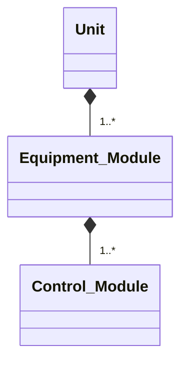
 <figcaption>Unit based on S88</figcaption>


<br>

# <u> 1ère étape </u>

## Objectif :
Programmer des **DUT** (Data User Type) sous forme de structures de données qui permettront de regrouper plusieurs variables (qui peuvent être de différents types de données) dans une unité logique cohérente.


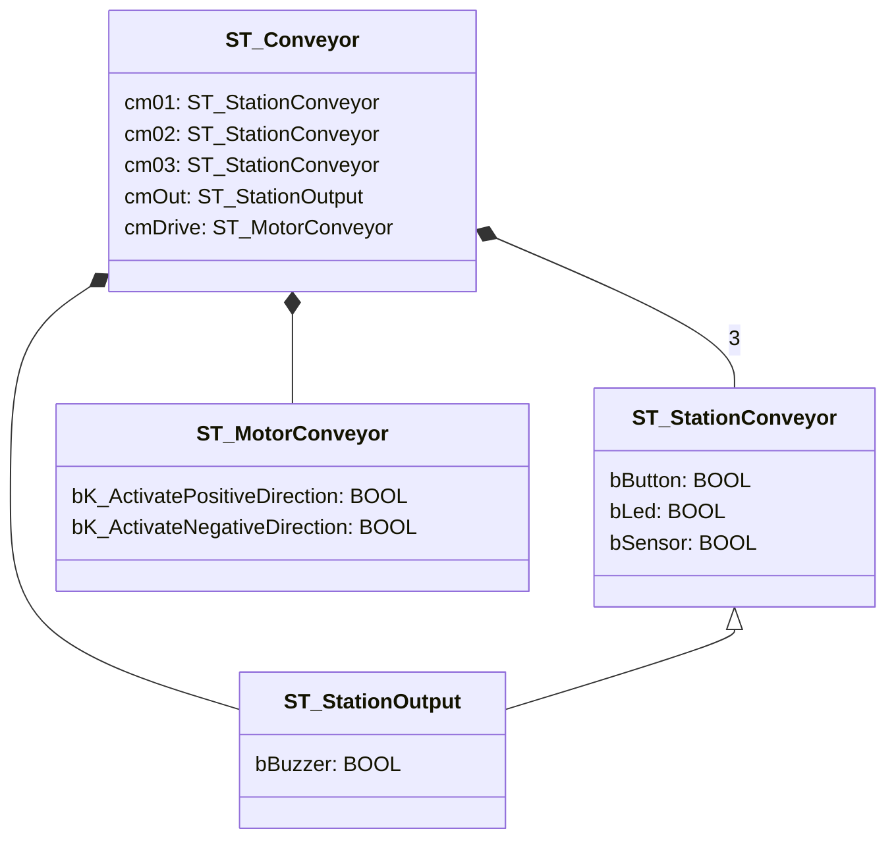

<figcaption> Structures de données du convoyeur <figcaption>


<br>

<u>Remarque</u> : ST_StationOutput "hérite" de ST_StationConveyor.


<br>

<figure>
    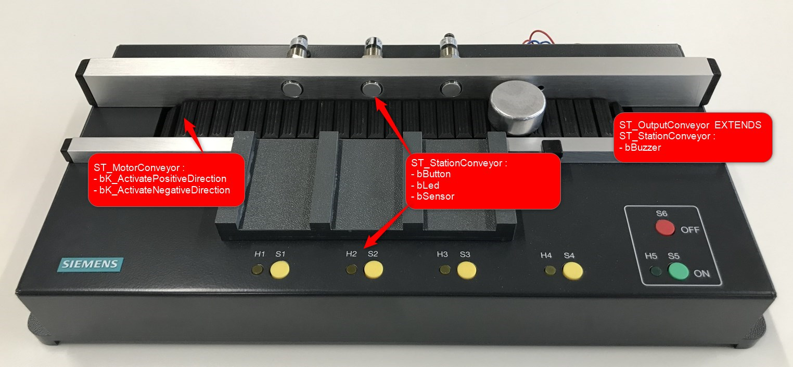
    <figcaption>Structures de données du convoyeur.</figcaption>
</figure>


<br>


## Comment ajouter un DUT (Data User Type) ?
<figure>
    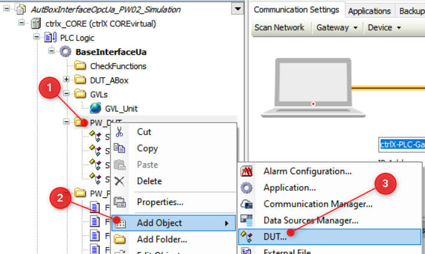
    <figcaption>Ajouter un DUT (Data User Type)</figcaption>
</figure>


<br>

# <u> 2ème étape </u>

## Objectifs :
- Créer une instance de la structure de données ``ST_Conveyor`` dans le programme ``PLC_PRG`` et compléter le programme afin de lier les entrées et les sorties du convoyeur avec cette instance.
- Vérifier le fonctionnement des entrées /sorties du convoyeur.

<br>

<u>Remarque </u> : La structure de données ``GVL_Abox.uaAboxInterface`` représente l'interface avec les entrées/sorties du PLC.

<br>

Compléter votre programme principal ``PLC_PRG`` en vous référant à l'exemple ci-dessous.


```iecst
PROGRAM PLC_PRG
VAR
	diMyLoop		: DINT;
	emConveyor		: ST_Conveyor;  // Your structure
END_VAR
//
// Manage inputs
//
// cm01
emConveyor.cm01.bButton := GVL_Abox.uaAboxInterface.uaDigitalIn.Input_0_0;
// other inputs

//
// Code
//

//
// Manage outputs
//
// cm01
GVL_Abox.uaAboxInterface.uaDigitalOut.Output_0_0 := emConveyor.cm01.bLed;
// Other outputs
```


<br>


## PLC Tags, SDS, Software Design Specification
|Siemens Address|Data Type|ctrlX Global Var Struct                         |Hardware on conveyor|
|---------------|---------|------------------------------------------------|--------------------|
|%I0.0          |BOOL     |GVL_Abox.uaAboxInterface.uaDigitalIn.Input_0_0  |Push Button S1      | 
|%I0.1          |BOOL     |GVL_Abox.uaAboxInterface.uaDigitalIn.Input_0_1  |Push Button S2      | 
|%I0.2          |BOOL     |GVL_Abox.uaAboxInterface.uaDigitalIn.Input_0_2  |Push Button S3      | 
|%I0.3          |BOOL     |GVL_Abox.uaAboxInterface.uaDigitalIn.Input_0_3  |Push Button S4      | 
|%I0.4          |BOOL     |GVL_Abox.uaAboxInterface.uaDigitalIn.Input_0_4  |Sensor Active B1    | 
|%I0.5          |BOOL     |GVL_Abox.uaAboxInterface.uaDigitalIn.Input_0_5  |Sensor Active B2    | 
|%I0.6          |BOOL     |GVL_Abox.uaAboxInterface.uaDigitalIn.Input_0_6  |Sensor Active B3    | 
|%I0.7          |BOOL     |GVL_Abox.uaAboxInterface.uaDigitalIn.Input_0_7  |Sensor Not Active B4| 
|%Q0.0          |BOOL     |GVL_Abox.uaAboxInterface.uaDigitalOut.Output_0_0|Led H1              | 
|%Q0.1          |BOOL     |GVL_Abox.uaAboxInterface.uaDigitalOut.Output_0_1|Led H2              |
|%Q0.2          |BOOL     |GVL_Abox.uaAboxInterface.uaDigitalOut.Output_0_2|Led H3              |
|%Q0.3          |BOOL     |GVL_Abox.uaAboxInterface.uaDigitalOut.Output_0_3|Led H4              |
|%Q0.4          |BOOL     |GVL_Abox.uaAboxInterface.uaDigitalOut.Output_0_4|Contactor K1        |
|%Q0.5          |BOOL     |GVL_Abox.uaAboxInterface.uaDigitalOut.Output_0_5|Contactor K2        |
|%Q0.6          |BOOL     |GVL_Abox.uaAboxInterface.uaDigitalOut.Output_0_6|Buzzer A1           |

<br>

## Visualisation des données du programme


Le traitement d'un programme sur un automate est cyclique. **L'analyse step-by-step n'est en général pas possible**.

> La facilité d'accès aux données pendant le fonctionnement du programme est primordiale.

> L'accès aux données doit être prise en compte dès la phase de conception du programme.

<br>

### Commande en mode manuel du convoyeur avec l'outil "Watch"
Il existe dans chaque environnement de développement des PLC (IDE : Integrated Development Environment) la possibilité de visualiser et de forcer des variables.


<br>

Vérifier le fonctionnement des entrées/sorties du convoyeur à l'aide de l'outil "Watch".

<u> Marche à suivre </u> :

### 1. Ouvrir une fenêtre "Watch"
<figure>
    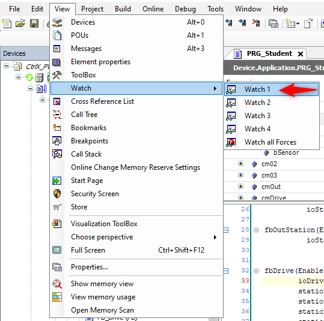
    <figcaption>Ajouter une fenêtre "Watch"</figcaption>
</figure>

<br>

### 2. Sélectionner l'élément désiré
Il est possible de sélectionner tout élément qui a été instancié, à savoir une variable, une structure ou un bloc fonctionnel.

<figure>
    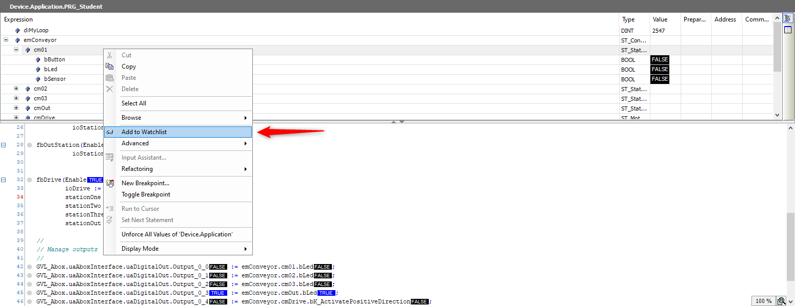
    <figcaption>Ajouter une élément dans une fenêtre "Watch"</figcaption>
</figure>

<br>

### 3. Visualiser/forcer un élément

<figure>
    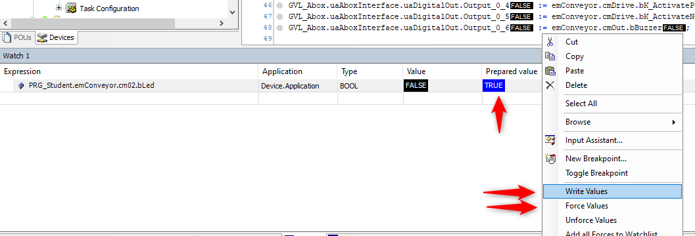
    <figcaption>Visualiser/forcer un élément dans une fenêtre "Watch"</figcaption>
</figure>


<br>

<u>Raccourcis </u> : 
Pour forcer  --> [F7]
Pour écrire  -->  [Ctrl + F7]

<u> Remarque</u> : 

**Forcer** une variable signifie que vous imposerez une valeur spécifique à une variable, indépendamment de ce que le programme pourrait essayer de lui assigner. Une fois forcée, la variable conserve cette valeur jusqu'à ce que vous la libériez du forçage. Ceci est utile pour les tests et le débogage.

**Écrire** une variable signifie simplement attribuer une valeur à une variable dans le cours normal de l'exécution du programme. Cette valeur peut être modifiée à mesure que le programme s'exécute et suit les règles et la logique définies dans le code.


<br>

# <u> 3ème étape </u>


# POU (Program Organization Unit)

## Objectifs :

- Programmer des **FB (Function Block)** qui vont permettre de piloter différents **Control Module (CM)**.
- Compléter le **programme** principal ``PLC_PRG`` (considéré ici comme un **Equipment Module (EM)**).

<br>

<figure>
    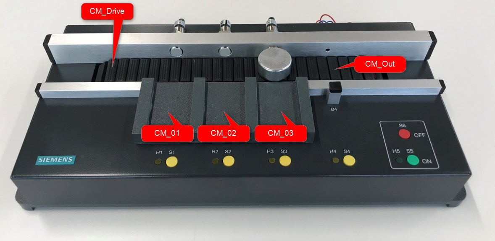
    <figcaption>Structure du convoyeur selon ISA 88</figcaption>
</figure>


<br>


- Le convoyeur est constitué de trois **Control Modules** identiques dédiés aux stations intermédiaires (--> CM_01, CM_02, CM_03).

- La station de sortie est constituée d'un **Control Module** dédié à la commande du moteur et d'un buzzer (--> CM_Out).
<u>Remarque </u> : Le capteur optique B4 est N.C. (Normally Closed) contrairement aux autres capteurs inductifs B1, B2 et B3.

- Le convoyeur est constitué d'un **Control Module** dédié à la commande du moteur (--> CM_Drive).


<br>


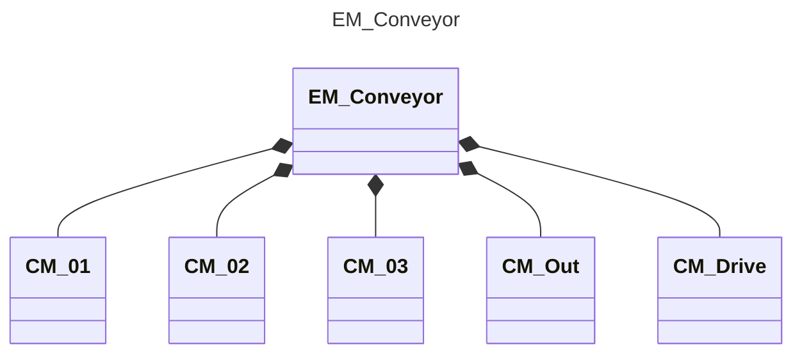
<figcaption>Diagramme d'objet du convoyeur</figcaption>


<br>

## Comment ajouter un POU ?
<figure>
    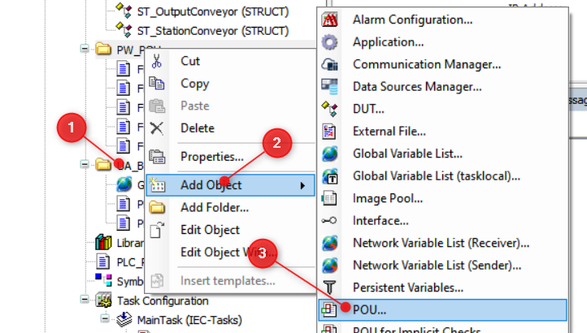
    <figcaption>Ajouter un POU (Program Organization Unit)</figcaption>
</figure>


<br>


<br>


## Description générale du fonctionnement
1. Le convoyeur avance si aucune pièce n'est présente.
2. Si l'on pose une pièce à l'entrée, elle avance jusqu'à la première station, puis s'arrête et incrémente le compteur de la station.
3. Si l'on appuie sur le bouton de la station, le convoyeur redémarre et amène la pièce à la station suivante.
4. L'arrivée de la pièce sur la dernière station déclenche une alarme sonore.


<br>
<br>

Programmer les différents **Control Modules** en respectant les URS (User Request Specification) ci-dessous.


## 1) FB_Station
### URS (User Request Specification)
- Si l'entrée ``Enable`` est ``FALSE``, le **FB** est inactif.
- Une variable ``VAR_IN_OUT`` permet de passer la structure ``ST_StationConveyor`` en paramètre.
- une variable de sortie ``diCounter`` compte le nombre de pièces qui sont détectées par le capteur en entrée de station.
- au moment où une pièce est détectée par le capteur, une sortie ``stop`` est activée à ``TRUE``, une sortie ``release`` est mise à ``FALSE``.
- La sortie hardware ``bLed`` prend la valeur de ``stop``.
- Si l'on appuie sur le bouton bButton, la sortie ``release`` passe à ```TRUE``` et la sortie ``stop`` passe à ``FALSE``.
- Si l'on appuie pendant deux secondes ou plus sur le bouton de la station, la variable ``diCounter`` passe à ``0```.

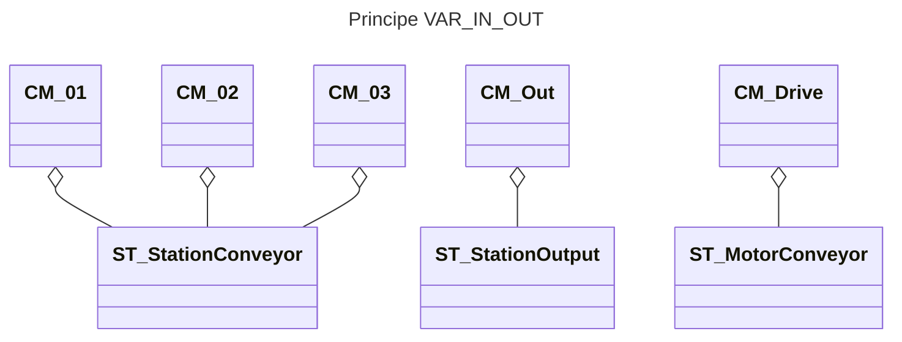

---

## 2) FB_OutStation
### URS (User Request Specification)
- La structure de donnée VAR_IN_OUT est ``ST_OutputConveyor``
- Ce FB a absolument le même manière que ``FB_Station`` à une exception prêt: la variable ``stop`` active le ``Buzzer``.

---

## 3) FB_Drive
### URS (User Request Specification)
- Si l'entrée ``Enable`` est ``FALSE``, le **FB** est inactif.
- Ce FB reçoit les 4 stations en paramètre, ``VAR_IN_OUT``, ainsi que la structure hardware ``ST_MotorConveyor``.
- Si l'une des variables ``stop`` des 4 stations est ``TRUE``, le convoyeur s'arrête. Sinon il avance dans la direction S1 --> S4.


---

# Appel des "Control Modules" depuis le programme principal

Compléter le programme principal ``PLC_PRG`` en intégrant l'appel des Control Modules en vous référant à l'exemple ci-dessous:


```iecst
PROGRAM PLC_PRG
VAR
    // If not in test mode, Function Blocks below are enabled
	testMode		: BOOL;
    
        fbStationOne	: FB_Station;
	fbStationTwo	: FB_Station;
	fbStationThree	: FB_Station;
	fbOutStation	: FB_OutStation;
	fbDrive		: FB_Drive;
END_VAR
```


```iecst
diMyLoop := diMyLoop + 1;

// Manage inputs
// cm01
emConveyor.cm01.bButton := GVL_Abox.uaAboxInterface.uaDigitalIn.Input_0_0;
...
// cm02
emConveyor.cm02.bButton := GVL_Abox.uaAboxInterface.uaDigitalIn.Input_0_1;
...
...


// Execute Control Modules
fbStationOne(Enable := NOT testMode, 
             ioStation := emConveyor.cm01);
fbStationTwo(Enable := NOT testMode, 
             ioStation := emConveyor.cm02);
fbStationThree(Enable := NOT testMode, 
               ioStation := emConveyor.cm03);
		  
fbOutStation(Enable := NOT testMode, 
             ioStation := emConveyor.cmOut);

fbDrive(Enable := NOT testMode,
	ioDrive := emConveyor.cmDrive,
        stationOne := fbStationOne,
        stationTwo := fbStationTwo,
        stationThree := fbStationThree,
        stationOut := fbOutStation);		  


// Manage outputs
//
GVL_Abox.uaAboxInterface.uaDigitalOut.Output_0_0 := emConveyor.cm01.bLed;
...
...
```


<br>


## Mode "Test"
La variable ``testMode`` de type BOOL peut être ajoutée pour permettre de désactiver l'appel des Control Modules.

```iecst
PROGRAM PLC_PRG
VAR
    // If not in test mode, Function Blocks below are enabled
	testMode		: BOOL;
    ...
END_VAR

//
// Execute Control Modules
fbStationOne(Enable := NOT testMode, 
             ioStation := emConveyor.cm01);

...
```


<br>


# Finalisation du programme

En vous référant au programme ``PLC_PRG`` ci-dessous, ajouter :
- une fonction qui gèrent les entrées (--> FC_GetInput)
- une fonction qui gèrent les sorties (--> FC_SetOutput)


```iecst
PROGRAM PLC_PRG
VAR
    // If not in test mode, Function Blocks below are enabled
	testMode		: BOOL;
    
        fbStationOne	: FB_Station;
	fbStationTwo	: FB_Station;
	fbStationThree	: FB_Station;
	fbOutStation	: FB_OutStation;
	fbDrive		: FB_Drive;
END_VAR
```


```iecst
diMyLoop := diMyLoop + 1;

// Manage inputs
FC_GetInput(ioHwInterface := GVL_Abox,
            ioPhysicalControl := emConveyor);

// Execute Control Modules
fbStationOne(Enable := NOT testMode, 
             ioStation := emConveyor.cm01);
fbStationTwo(Enable := NOT testMode, 
             ioStation := emConveyor.cm02);
fbStationThree(Enable := NOT testMode, 
               ioStation := emConveyor.cm03);
		  
fbOutStation(Enable := NOT testMode, 
             ioStation := emConveyor.cmOut);

fbDrive(Enable := NOT testMode,
		ioDrive := emConveyor.cmDrive,
        stationOne := fbStationOne,
        stationTwo := fbStationTwo,
        stationThree := fbStationThree,
        stationOut := fbOutStation);		  

// Manage outputs
FC_SetOutput(ioHwInterface := GVL_Abox,
             ioPhysicalControl := emConveyor);


```