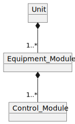
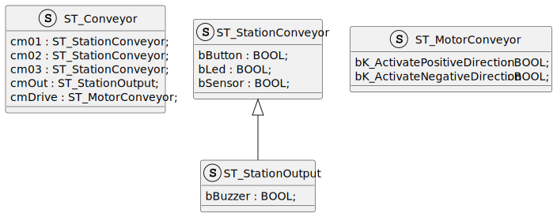
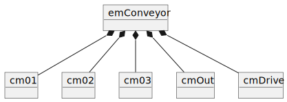

<h1 align="left">
  <br>
  
  <br>
  HEI-Vs Engineering School - Industrial Automation Base
  <br>
</h1>

Cours AutB

Author: [Cédric Lenoir](mailto:cedric.lenoir@hevs.ch)

# LAB 02 A data structure to manage a conveyor

# Préambule
## Communication PLC to PLC
### Historique
Pour des raisons historiques, nous utilisons le PLC dans le ctrlX Core pour la programmation, mais le PLC Siemens S7 pour la communication avec les entrées et les sorties. Ce n'est pas forcément très pratique, mais c'est aussi conforme à la réalité de l'industrie. Il est rare d'avoir la chance de pouvoir concevoir une nouvelle installation, ou une nouvelle machine en faisant abstraction du passé.

### Disponibilité du firmware
La communication entre le PLC S7 et le PLC ctrlX aurait du utiliser un bus temps réel Profinet. Le firmware de ce bus n'était pas fonctionnel, nous avons du utiliser un **plan B**. **OPC-UA**.

Il faut être clair, **nous utilisons OPC-UA un protocol client serveur dans un cas d'application qui n'est le pas le sien**. C'est acceptable en laboratoire, mais il sera probablement constaté que le système n'est pas stable et que les temps de réponse entre les capteurs et les actuateurs ne sont pas stables. **Innaceptable dans l'industrie**.

-   Le ctrlX est un serveur OPC-UA
-   Le S7 est un client OPC-UA

### Concrètement
Le PLC Siemens écrit ses entrées sur des variables globales du ctrlX et lit les variables globales de sortie pour les envoyer vers les actuateurs.
Le temps de cycle est tellement peu stable que nous pouvons le constater visuellement ou auditivement avec le buzzer, alors que si nous pouvions utiliser le protocol Profinet IO, nous aurions des temps de réponse de quelques millisecondes.

### Contrainte techniques à l'éciture du code
**Les résultats des détecteurs peuvent être imprécis**.
La manière d'utiliser les tags est particulière. Un compilateur ne traite pas des variables qui ne sont pas utilisées dans le code. Comme nous avons besoin de ses variables pour la communication, nous les avons utilisées pour les mettre à disposition via une structure.

Cela simplifie l'écriture du code, puisque toutes les données en entrée et sorties sont disponibles pour la progrmmation via la structure globale : ``GVL_Abox.uaAboxInterface``.

### Défaut de fonctionnement
Les entrées et sorties sont pilotée par le PLC Siemens en fonction des variables globales du ctrlX.
Si le PLC Siemens ne parvient pas à communiquer, il fera clignoter les lampes de la cellule.

<figure>
    
    <figcaption>Buttons and Signals of the Automation Box</figcaption>
</figure>

-   Pour fonctionner, le PLC Siemens doit être en service avec le programme nécessaire. AuBoxProfinetStation_V**.
-   Si les lampes Bleu/Vert/Rouges clignotent alternativement, cela signifie que la communication est perdue. Cela se passe souvent quand un nouveau programme est chargé dans le ctrlX. **En général, il suffit de faire un reset du Siemens**.
-   **Attention!** Reset ne signifie pas coupure de l'alimentation. Le PC de programmation utliser le réseau qui dépend de l'alimentation du Siemens.


# Objectif
- Construire une structure de donnée pour piloter un convoyeur.
- Ecrire une série de POU pour piloter le convoyeur en mode semi-automatique.

> Nous faisons une différence entre la structure de données ``GVL_Abox.uaAboxInterface``, qui n'est qu'une représentation de l'interface électrique du PLC avec le structure de données que vous allez écrire, qui elle représente la réalité physique de la machine.

> Voir AutB Module 01, Interface.

Il existe des standards qui définissent des structures pour les machines dans l'industrie. L'intérêt de ses structures est de faciliter la réutilisabilité du code sur plusieur projets. Nous nous basons ici sur le standard ISA 88.

-   Ici, le convoyeur est défini comme un équipement, **Equipment Module**.

-   Le convoyeur est composé de plusieurs **Control Modules**.

-   Le **Control Module** est le plus petit module défini dans la norme **ISA 88**.

-   Un **Equipment Module** est constitué de plusieurs **Control Modules**.

-   Une machine, **Unit** est constituée de plusieur **Equipment Modules**.

Nous considérons ici notre convoyeur comme un élément d'une machine, **Unit**. 
*La machine peut elle même faire partie d'un ensemble de machines*.

<figure>
    
    <figcaption>Unit based on S88</figcaption>
</figure>

# Première étape
Coder une structure de donnée qui sera utilisée pour piloter le convoyeur.
<figure>
    
    <figcaption>Structure du convoyeur selon ISA 88</figcaption>
</figure>

Le convoyeur est constitué d'un module CM_Drive pour piloter le moteur.

Le convoyeur est consitué de trois stations intermédiaires identiques.

La station de sortie est complétée d'un buzzer. *Noter que l'entrée du capteur S4 est inversée par rapport aux autres capteurs Sx, la valeur par défaut est ``TRUE``*.

<figure>
    
    <figcaption>Structure de données du convoyeur à coder.</figcaption>
</figure>

> ST_StationOutput hérite de ST_SationConveyor.

<figure>
    
    <figcaption>Diagram d'objet du convoyeur</figcaption>
</figure>

## DUT Help
<figure>
    
    <figcaption>Ajouter un DUT Data User Type</figcaption>
</figure>

# Deuxième étape
Nous allons utiliser la structure pour relier le hardware au convoyeur et vérifier les entrées et sorties.

## PLC Tags, SDS, Software Design Specification
|Siemens Address|Data Type|ctrlX OPC UA Tag              |ctrlX Global Var Struct                         |Hardware on conveyor|
|---------------|---------|------------------------------|------------------------------------------------|--------------------|
|%I0.0          |BOOL     |UA_DigitalInput_32_Input_0_0  |GVL_Abox.uaAboxInterface.uaDigitalIn.Input_0_0  |Push Button S1      | 
|%I0.1          |BOOL     |UA_DigitalInput_32_Input_0_1  |GVL_Abox.uaAboxInterface.uaDigitalIn.Input_0_1  |Push Button S2      | 
|%I0.2          |BOOL     |UA_DigitalInput_32_Input_0_2  |GVL_Abox.uaAboxInterface.uaDigitalIn.Input_0_2  |Push Button S3      | 
|%I0.3          |BOOL     |UA_DigitalInput_32_Input_0_3  |GVL_Abox.uaAboxInterface.uaDigitalIn.Input_0_3  |Push Button S4      | 
|%I0.4          |BOOL     |UA_DigitalInput_32_Input_0_4  |GVL_Abox.uaAboxInterface.uaDigitalIn.Input_0_4  |Sensor Active B1    | 
|%I0.5          |BOOL     |UA_DigitalInput_32_Input_0_5  |GVL_Abox.uaAboxInterface.uaDigitalIn.Input_0_5  |Sensor Active B2    | 
|%I0.6          |BOOL     |UA_DigitalInput_32_Input_0_6  |GVL_Abox.uaAboxInterface.uaDigitalIn.Input_0_6  |Sensor Active B3    | 
|%I0.7          |BOOL     |UA_DigitalInput_32_Input_0_7  |GVL_Abox.uaAboxInterface.uaDigitalIn.Input_0_7  |Sensor Not Active B4| 
|%Q0.0          |BOOL     |UA_DigitalOutput_32_Output_0_0|GVL_Abox.uaAboxInterface.uaDigitalOut.Output_0_0|Led H1              | 
|%Q0.1          |BOOL     |UA_DigitalOutput_32_Output_0_1|GVL_Abox.uaAboxInterface.uaDigitalOut.Output_0_1|Led H2              |
|%Q0.2          |BOOL     |UA_DigitalOutput_32_Output_0_2|GVL_Abox.uaAboxInterface.uaDigitalOut.Output_0_2|Led H3              |
|%Q0.3          |BOOL     |UA_DigitalOutput_32_Output_0_3|GVL_Abox.uaAboxInterface.uaDigitalOut.Output_0_3|Led H4              |
|%Q0.4          |BOOL     |UA_DigitalOutput_32_Output_0_4|GVL_Abox.uaAboxInterface.uaDigitalOut.Output_0_4|Contactor K1        |
|%Q0.5          |BOOL     |UA_DigitalOutput_32_Output_0_5|GVL_Abox.uaAboxInterface.uaDigitalOut.Output_0_5|Contactor K2        |
|%Q0.6          |BOOL     |UA_DigitalOutput_32_Output_0_6|GVL_Abox.uaAboxInterface.uaDigitalOut.Output_0_6|Buzzer A1           |

# Visualisation des données du programme
Autant on dit qu'un programme sera souvent plus souvent lu, qu'écrit, vous allez probablement consacrer plus de temps à débugger votre programme qu'à le coder.

Il faut garder en tête que le programme d'un automate est cyclique. **L'analyse step-by-step n'est en général pas possible**, et même si elle est possible en simulation, cela ne permet souvent pas de déceler les problèmes qui se passent avec le hardware connecté.

> La facilité d'accès aux données pendant le fonctionnement du programme est primordiale.

> L'accès aux données doit être prise en compte dès la phase de conception du programme.

## Découplage du programme et utilisation des "Watch"
Il existe dans chaque outil de programmation de PLC, Integrated Development Environment (IDE) la possibilité de forcer des variables à prendre des valeurs données. Cela ne fonctionne toutefois, *en particulier pour les variables de sorties*, que si le programme n'écrit pas sur ces variables à un autre endroit dans le code.

```iecst
PROGRAM PLC_PRG
VAR
	diMyLoop		: DINT;
	emConveyor		: ST_Conveyor;  // Your structure
END_VAR
//
// Manage inputs
//
// cm01
emConveyor.cm01.bButton := GVL_Abox.uaAboxInterface.uaDigitalIn.Input_0_0;
// other inputs

//
// Code
//

//
// Manage outputs
//
// cm01
GVL_Abox.uaAboxInterface.uaDigitalOut.Output_0_0 := emConveyor.cm01.bLed;
// Other outputs
```

Une fois ce code terminé, il devrait être possible de piloter le convoyeur en mode manuel via la fenêtre Watch.
Les fenêtre de watch se retrouvent selon une forme plus ou moins similaire sur tous les types d'automate.

### Open a Watch window
<figure>
    
    <figcaption>Add a watch window</figcaption>
</figure>

### Select a variable to watch
De manière générale, il est possible de visualiser tout élément qui a été instancié, à savoir une structure ou un bloc fonctionnel.
<figure>
    
    <figcaption>Add a structure to a watch window</figcaption>
</figure>

### Write a value
Il est ensuite possible d'écrire des valeurs dans la structure pour tester certains comportements.
<figure>
    
    <figcaption>Read write values on watch window/figcaption>
</figure>

### OPC UA
Nous avons vu lors du premiers travail pratique comment accéder à une variable via **OPC UA** et comment la visualiser sur **Prosys OPC UA Monitor**. Il existe aussi le lociciel [Unified Automation UA Expert](https://www.unified-automation.com/products/development-tools/uaexpert.html?gclid=CjwKCAiA75itBhA6EiwAkho9e7XBs3l7-PEgNn2xrsfeEjfDEDYSifBPYMT8jaIy5YWG2bsgxJNhTRoCSE4QAvD_BwE) qui est un client OPC UA gratuit particulièrement souple.

Il vous suffit ici de quelques clics pour installer un logiciel qui permet de visualier vos données depuis n'importe quel laptop branché sur le même sous-réseau que le PLC ctrlX Core.

<figure>
    
    <figcaption>Watch_Using_Opc_Ua_Expert/figcaption>
</figure>

# POU, Program Organisation Unit
Le programme principal doit être complété avec 4 **POU** afin de piloter les différents **Control Module**, **CM**.
Le programme principal est considéré ici comme un équipement, **Equipment Module**, **EM**.

## POU Help
<figure>
    
    <figcaption>Ajouter un POU Program Organisation Unit</figcaption>
</figure>

```iecst
PROGRAM PLC_PRG
VAR
    // If not in test mode, Function Blocks below are enabled
	testMode		: BOOL;
    
    fbStationOne	: FB_Station;
	fbStationTwo	: FB_Station;
	fbStationThree	: FB_Station;
	fbOutStation	: FB_OutStation;
	fbDrive			: FB_Drive;
END_VAR
```

## Test mode
Dans le programme, nous introduisons **un mode test basic**. L'avantage: il suffit d'activer le ``BOOL`` testMode pour désactiver la partie algorithique.

```iecst
PROGRAM PLC_PRG
VAR
    // If not in test mode, Function Blocks below are enabled
	testMode		: BOOL;
    ...
END_VAR

//
// Implementation
//
fbStationOne.Enable := NOT testMode;
```

## FB_Station
### URS, User Request Specification
- Si l'entrée ``Enable`` est ``FALSE``, le **FB** est inactif.
- Une variable ``VAR_IN_OUT`` permet de passer la structure ``ST_StationConveyor`` en paramètre.
- une variable de sortie ``diCounter`` compte le nombre de pièces qui sont détectées par le capteur en entrée de station.
- au moment où une pièce est détectée par le capteur, une sortie ``stop`` est activée à ``TRUE``, une sortie ``release`` est mise à ``FALSE``.
- La sortie hardware ``bLed`` prend la valeur de ``stop``.
- Si l'on appuie sur le bouton bButton, la sortie ``release`` passe à ```TRUE``` et la sortie ``stop`` passe à ``FALSE``.
- Si l'on appuie pendant deux secondes ou plus sur le bouton de la station, la variable ``diCounter`` passe à ``0```.

## FB_OutStation
### URS, User Request Specification
- La structure de donnée VAR_IN_OUT est ``ST_OutputConveyor``
- Ce FB a absolument le même manière que ``FB_Station`` à une exception prêt: la variable ``stop`` active le ``Buzzer``.

## FB_Drive
### URS, User Request Specification
- Si l'entrée ``Enable`` est ``FALSE``, le **FB** est inactif.
- Ce FB reçoit les 4 stations en paramètre, ``VAR_IN_OUT``, ainsi que la structure hardware ``ST_MotorConveyor``.
- Si l'une des variables ``stop`` des 4 stations est ``TRUE``, le convoyeur s'arrête. Sinon il avance dans la direction S1 --> S4.

# Mise en forme finale
-   Ajouter deux fonctions qui gèrent les entrées, FC_GetInput et les sorties, FC_SetOutput de manière à ce que le code final de PLC_PRG ressemble à l'exemple ci-dessous:

```iecst
diMyLoop := diMyLoop + 1;

// Manage inputs
FC_GetInput(ioHwInterface := GVL_Abox,
            ioPhysicalControl := emConveyor);

// Execute Control Modules
fbStationOne(Enable := NOT testMode, 
             ioStation := emConveyor.cm01);
fbStationTwo(Enable := NOT testMode, 
             ioStation := emConveyor.cm02);
fbStationThree(Enable := NOT testMode, 
               ioStation := emConveyor.cm03);
		  
fbOutStation(Enable := NOT testMode, 
             ioStation := emConveyor.cmOut);

fbDrive(Enable := NOT testMode,
		ioDrive := emConveyor.cmDrive,
        stationOne := fbStationOne,
        stationTwo := fbStationTwo,
        stationThree := fbStationThree,
        stationOut := fbOutStation);		  

// Manage outputs
FC_SetOutput(ioHwInterface := GVL_Abox,
             ioPhysicalControl := emConveyor);
```

# Résumé et test
On créer un programme PLC pour piloter un équipement représenté par un convoyeur constitué de plusieurs modules de contrôles appelés ici stations.
1.  Vide, le convoyeur avance.
2.  Si l'on pose une pièce à l'entrée, elle avance jusqu'à la première station, puis s'arrête et incrémente le compteur de la stations.
3. Si l'on appuie sur le bouton, le convoyeur redémarre et amène la pièce à la station suivante.
4. L'arrivée de la pièce sur la dernière station déclenche une alarme sonore.

[Lien vers la liste des tags complète](./AutB_CtrlX_Tags.md)
