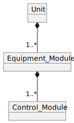

<h1 align="left">
  <br>
  
  <br>
  HEI-Vs Engineering School - Industrial Automation Base
  <br>
</h1>

Cours AutB

Author: [Cédric Lenoir](mailto:cedric.lenoir@hevs.ch)

# LAB 02 A data structure to manage a conveyor

# Präambel
## SPS-zu-SPS-Kommunikation
### Geschichte
Aus historischen Gründen verwenden wir für die Programmierung die SPS im ctrlX Core, für die Kommunikation mit Ein- und Ausgängen jedoch die Siemens S7 SPS. Das ist nicht unbedingt sehr praktisch, entspricht aber auch der Realität der Branche. Es ist selten, dass man die Möglichkeit hat, eine neue Anlage oder eine neue Maschine zu entwerfen und dabei die Vergangenheit zu ignorieren.

### Firmware-Verfügbarkeit
Die Kommunikation zwischen der S7-SPS und der ctrlX-SPS hätte über einen Profinet-Echtzeitbus erfolgen sollen. Die Firmware dieses Busses war nicht funktionsfähig, wir mussten einen **Plan B** verwenden. **OPC-UA**.

Es muss klar sein, **wir verwenden OPC-UA, ein Client-Server-Protokoll in einem Anwendungsfall, der nicht unser eigener ist**. Im Labor ist dies akzeptabel, allerdings wird man vermutlich feststellen, dass das System nicht stabil ist und die Reaktionszeiten zwischen den Sensoren und Aktoren nicht stabil sind. **In der Branche nicht akzeptabel**.

- Der ctrlX ist ein OPC-UA-Server
- Die S7 ist ein OPC-UA-Client

### Konkret
Die Siemens-SPS schreibt ihre Eingänge in globale ctrlX-Variablen und liest die globalen Ausgangsvariablen, um sie an die Aktoren zu senden.
Die Zykluszeit ist so instabil, dass wir es optisch oder akustisch am Summer erkennen können, wohingegen wir bei Verwendung des Profinet IO-Protokolls Reaktionszeiten von wenigen Millisekunden hätten.

### Technische Einschränkungen beim Schreiben des Codes
**Die Detektorergebnisse können ungenau sein**.
Die Art der Verwendung von Tags ist besonders. Ein Compiler befasst sich nicht mit Variablen, die nicht im Code verwendet werden. Da wir seine Variablen zur Kommunikation benötigen, haben wir sie genutzt, um sie über eine Struktur verfügbar zu machen.

Dies vereinfacht das Schreiben des Codes, da alle Ein- und Ausgabedaten über die globale Struktur ``GVL_Abox.uaAboxInterface`` für die Programmierung verfügbar sind.

### Fehlfunktion
Die Ein- und Ausgänge werden von der Siemens-SPS entsprechend den globalen Variablen des ctrlX gesteuert.
Wenn die Kommunikation der Siemens-SPS fehlschlägt, blinken die Zellenlichter.

<figure>
    
    <figcaption>Buttons and Signals of the Automation Box</figcaption>
</figure>

- Zum Betrieb muss die Siemens-SPS mit dem erforderlichen Programm laufen. AuBoxProfinetStation_V**.
- Wenn die blauen/grünen/roten Lampen abwechselnd blinken, bedeutet dies, dass die Kommunikation unterbrochen ist. Dies passiert häufig, wenn ein neues Programm in ctrlX geladen wird. **Im Allgemeinen müssen Sie nur den Siemens zurücksetzen**.
- **Achtung!** Ein Zurücksetzen bedeutet nicht, dass die Stromversorgung unterbrochen wird. Der Programmier-PC nutzt das Netzwerk, das auf die Siemens-Stromversorgung angewiesen ist.


# Zielsetzung
- Erstellen Sie eine Datenstruktur zur Steuerung eines Förderers.
- Schreiben Sie eine Reihe von **POU**, um das Förderband im halbautomatischen Modus zu steuern.

> Wir unterscheiden zwischen der Datenstruktur ``GVL_Abox.uaAboxInterface``, die nur eine Darstellung der elektrischen Schnittstelle der SPS ist, und der Datenstruktur, die Sie schreiben werden, die die physische Realität der Maschine darstellt.

> Siehe AutB Modul 01, Schnittstelle.

Es gibt Standards, die Strukturen für Maschinen in der Industrie definieren. Der Vorteil seiner Strukturen besteht darin, dass der Code in mehreren Projekten wiederverwendbar ist. Wir orientieren uns hierbei am ISA 88 Standard.

- Hier wird der Förderer als Ausrüstung definiert, **Ausrüstungsmodul**.

- Der Förderer besteht aus mehreren **Steuermodulen**.

- Das **Steuermodul** ist das kleinste im **ISA 88**-Standard definierte Modul.

- Ein **Gerätemodul** besteht aus mehreren **Steuermodulen**.

- Eine Maschine, **Einheit**, besteht aus mehreren **Ausrüstungsmodulen**.

Hier betrachten wir unseren Förderer als Element einer Maschine, **Einheit**.
*Die Maschine kann selbst Teil einer Maschinengruppe sein*.

<figure>
    
    <figcaption>Unit based on S88</figcaption>
</figure>

# Erste Stufe
Codieren Sie eine Datenstruktur, die zur Steuerung des Förderers verwendet wird.

<figure>
    
    <figcaption>Structure du convoyeur selon ISA 88</figcaption>
</figure>

Der Förderer besteht aus einem ``CM_Drive-Modul`` zur Steuerung des Motors.

Der Förderer besteht aus drei identischen Zwischenstationen.

Die Ausgabestation wird durch einen Summer ergänzt. *Beachten Sie, dass der S4-Sensoreingang im Vergleich zu den anderen Sx-Sensoren invertiert ist, der Standardwert ist ``TRUE``.

<figure>
    
    <figcaption>Förderdatenstruktur zum Code</figcaption>
</figure>

> ST_StationOutput vererbt de ST_SationConveyor.

<figure>
    
    <figcaption>Förderobjektdiagramm</figcaption>
</figure>

## DUT Help
<figure>
    
    <figcaption>Fügen Sie einen DUT-Datenbenutzertyp hinzu</figcaption>
</figure>

# Zweiter Schritt
Wir werden die Struktur nutzen, um die Hardware mit dem Förderband zu verbinden und die Ein- und Ausgänge zu überprüfen.

## SPS-Tags, SDS, Software-Design-Spezifikation
|Siemens Address|Data Type|ctrlX OPC UA Tag              |ctrlX Global Var Struct                         |Hardware on conveyor|
|---------------|---------|------------------------------|------------------------------------------------|--------------------|
|%I0.0          |BOOL     |UA_DigitalInput_32_Input_0_0  |GVL_Abox.uaAboxInterface.uaDigitalIn.Input_0_0  |Push Button S1      | 
|%I0.1          |BOOL     |UA_DigitalInput_32_Input_0_1  |GVL_Abox.uaAboxInterface.uaDigitalIn.Input_0_1  |Push Button S2      | 
|%I0.2          |BOOL     |UA_DigitalInput_32_Input_0_2  |GVL_Abox.uaAboxInterface.uaDigitalIn.Input_0_2  |Push Button S3      | 
|%I0.3          |BOOL     |UA_DigitalInput_32_Input_0_3  |GVL_Abox.uaAboxInterface.uaDigitalIn.Input_0_3  |Push Button S4      | 
|%I0.4          |BOOL     |UA_DigitalInput_32_Input_0_4  |GVL_Abox.uaAboxInterface.uaDigitalIn.Input_0_4  |Sensor Active B1    | 
|%I0.5          |BOOL     |UA_DigitalInput_32_Input_0_5  |GVL_Abox.uaAboxInterface.uaDigitalIn.Input_0_5  |Sensor Active B2    | 
|%I0.6          |BOOL     |UA_DigitalInput_32_Input_0_6  |GVL_Abox.uaAboxInterface.uaDigitalIn.Input_0_6  |Sensor Active B3    | 
|%I0.7          |BOOL     |UA_DigitalInput_32_Input_0_7  |GVL_Abox.uaAboxInterface.uaDigitalIn.Input_0_7  |Sensor Not Active B4| 
|%Q0.0          |BOOL     |UA_DigitalOutput_32_Output_0_0|GVL_Abox.uaAboxInterface.uaDigitalOut.Output_0_0|Led H1              | 
|%Q0.1          |BOOL     |UA_DigitalOutput_32_Output_0_1|GVL_Abox.uaAboxInterface.uaDigitalOut.Output_0_1|Led H2              |
|%Q0.2          |BOOL     |UA_DigitalOutput_32_Output_0_2|GVL_Abox.uaAboxInterface.uaDigitalOut.Output_0_2|Led H3              |
|%Q0.3          |BOOL     |UA_DigitalOutput_32_Output_0_3|GVL_Abox.uaAboxInterface.uaDigitalOut.Output_0_3|Led H4              |
|%Q0.4          |BOOL     |UA_DigitalOutput_32_Output_0_4|GVL_Abox.uaAboxInterface.uaDigitalOut.Output_0_4|Contactor K1        |
|%Q0.5          |BOOL     |UA_DigitalOutput_32_Output_0_5|GVL_Abox.uaAboxInterface.uaDigitalOut.Output_0_5|Contactor K2        |
|%Q0.6          |BOOL     |UA_DigitalOutput_32_Output_0_6|GVL_Abox.uaAboxInterface.uaDigitalOut.Output_0_6|Buzzer A1           |

# Visualisierung von Programmdaten
Auch wenn gesagt wird, dass ein Programm oft häufiger gelesen als geschrieben wird, werden Sie wahrscheinlich mehr Zeit mit dem Debuggen Ihres Programms verbringen als mit dem Codieren.

Es ist wichtig zu bedenken, dass das Programm einer SPS zyklisch ist. **Eine schrittweise Analyse ist im Allgemeinen nicht möglich**, und selbst wenn sie in der Simulation möglich ist, können Sie damit häufig keine Probleme erkennen, die mit der angeschlossenen Hardware auftreten.

> Ein einfacher Zugriff auf die Daten während der Programmausführung ist unerlässlich.

> Der Zugriff auf Daten muss bereits in der Programmentwurfsphase berücksichtigt werden.

## Entkopplung des Programms und Nutzung von **Watch**
In jedem SPS-Programmiertool, der Integrated Development Environment (IDE), besteht die Möglichkeit, Variablen zu zwingen, bestimmte Werte anzunehmen. Dies funktioniert jedoch *besonders bei Ausgabevariablen* nur, wenn das Programm nicht an anderer Stelle im Code auf diese Variablen schreibt.

```iecst
PROGRAM PLC_PRG
VAR
	diMyLoop		: DINT;
	emConveyor		: ST_Conveyor;  // Your structure
END_VAR
//
// Manage inputs
//
// cm01
emConveyor.cm01.bButton := GVL_Abox.uaAboxInterface.uaDigitalIn.Input_0_0;
// other inputs

//
// Code
//

//
// Manage outputs
//
// cm01
GVL_Abox.uaAboxInterface.uaDigitalOut.Output_0_0 := emConveyor.cm01.bLed;
// Other outputs
```

Sobald dieser Code abgeschlossen ist, sollte es möglich sein, das Förderband im manuellen Modus über das **Watch** Fenster zu steuern.
Das **Watch** Fenster finden sich in mehr oder weniger ähnlicher Form bei allen Automatentypen.

### Open a Watch window
<figure>
    
    <figcaption>Add a watch window</figcaption>
</figure>

### Select a variable to watch
De manière générale, il est possible de visualiser tout élément qui a été instancié, à savoir une structure ou un bloc fonctionnel.
<figure>
    
    <figcaption>Add a structure to a watch window</figcaption>
</figure>

### Write a value
Im Allgemeinen ist es möglich, jedes instanziierte Element, nämlich eine Struktur oder einen Funktionsblock, zu visualisieren.
<figure>
    
    <figcaption>Read write values on watch window/figcaption>
</figure>

### OPC UA
Wir haben in der ersten praktischen Arbeit gesehen, wie man über **OPC UA** auf eine Variable zugreift und diese auf dem **Prosys OPC UA Monitor** visualisiert. Es gibt auch die Software [Unified Automation UA Expert](https://www.unified-automation.com/products/development-tools/uaexpert.html?gclid=CjwKCAiA75itBhA6EiwAkho9e7XBs3l7-PEgNn2xrsfeEjfDEDYSifBPYMT8jaIy5YWG2bsgxJNhTROCSE4QAvD_BwE). ist ein besonders flexibles kostenloses OPC UA Klient.

Sie benötigen lediglich ein paar Klicks, um eine Software zu installieren, mit der Sie Ihre Daten von jedem Laptop aus anzeigen können, der mit demselben Subnetz wie die ctrlX Core-SPS verbunden ist.

<figure>
    
    <figcaption>Watch_Using_Opc_Ua_Expert/figcaption>
</figure>

# POU, Program Organisation Unit
Das Hauptprogramm muss mit 4 **POU** ergänzt werden, um die verschiedenen **Control Module**, **CM**, zu steuern.
Das Hauptprogramm wird hier als Ausrüstung, **Equipment Module**, **EM** betrachtet.

## POU Help
<figure>
    
    <figcaption>Füge eins hinzu POU Program Organisation Unit</figcaption>
</figure>

```iecst
PROGRAM PLC_PRG
VAR
    // If not in test mode, Function Blocks below are enabled
	testMode		: BOOL;
    
    fbStationOne	: FB_Station;
	fbStationTwo	: FB_Station;
	fbStationThree	: FB_Station;
	fbOutStation	: FB_OutStation;
	fbDrive			: FB_Drive;
END_VAR
```

## Test mode
Im Programm führen wir **einen grundlegenden Testmodus** ein. Der Vorteil: Sie müssen lediglich den ``BOOL`` testMode aktivieren, um den algorithmischen Teil zu deaktivieren.

```iecst
PROGRAM PLC_PRG
VAR
    // If not in test mode, Function Blocks below are enabled
	testMode		: BOOL;
    ...
END_VAR

//
// Implementation
//
fbStationOne.Enable := NOT testMode;
```

## FB_Station
### URS, Benutzeranforderungsspezifikation
- Wenn der ``Enable``-Eintrag ``FALSE`` ist, ist der **FB** inaktiv.
- Mit einer Variable ``VAR_IN_OUT`` können Sie die Struktur ``ST_StationConveyor`` als Parameter übergeben.
- Eine Ausgangsvariable ``diCounter`` zählt die Anzahl der Stücke, die vom Sensor am Stationseingang erkannt werden.
- Wenn ein Teil vom Sensor erkannt wird, wird ein ``Stop``-Ausgang auf ``TRUE`` aktiviert, ein ``Release``-Ausgang wird auf ``FALSE`` gesetzt.
- Der Hardware-Ausgang ``bLed`` nimmt den Wert von ``stop`` an.
- Wenn Sie den bButton drücken, ändert sich der Ausgang ``release`` auf ``TRUE`` und der Ausgang ``stop`` auf ``FALSE``.
- Wenn Sie die Stationstaste zwei Sekunden oder länger drücken, ändert sich die Variable ``diCounter`` auf ``0``.

## FB_OutStation
### URS, Benutzeranforderungsspezifikation
- Die Datenstruktur VAR_IN_OUT ist ``ST_OutputConveyor``.
- Dieser FB hat absolut den gleichen Ablauf wie ``FB_Station``, mit einer Ausnahme: Die Variable ``stop`` aktiviert den ``Summer``.

## FB_Drive
### URS, Benutzeranforderungsspezifikation
- Wenn der ``Enable``-Eintrag ``FALSE`` ist, ist der **FB** inaktiv.
- Dieser FB empfängt als Parameter die 4 Stationen ``VAR_IN_OUT``, sowie die Hardwarestruktur ``ST_MotorConveyor``.
- Wenn eine der ``Stop``-Variablen der 4 Stationen ``TRUE`` ist, stoppt das Förderband. Ansonsten geht es in Richtung S1 --> S4 weiter.

# Endgültige Formatierung
- Fügen Sie zwei Funktionen hinzu, die Eingaben verarbeiten, FC_GetInput, und Ausgaben, FC_SetOutput, sodass der endgültige PLC_PRG-Code wie im folgenden Beispiel aussieht:

```iecst
diMyLoop := diMyLoop + 1;

// Manage inputs
FC_GetInput(ioHwInterface := GVL_Abox,
            ioPhysicalControl := emConveyor);

// Execute Control Modules
fbStationOne(Enable := NOT testMode, 
             ioStation := emConveyor.cm01);
fbStationTwo(Enable := NOT testMode, 
             ioStation := emConveyor.cm02);
fbStationThree(Enable := NOT testMode, 
               ioStation := emConveyor.cm03);
		  
fbOutStation(Enable := NOT testMode, 
             ioStation := emConveyor.cmOut);

fbDrive(Enable := NOT testMode,
		ioDrive := emConveyor.cmDrive,
        stationOne := fbStationOne,
        stationTwo := fbStationTwo,
        stationThree := fbStationThree,
        stationOut := fbOutStation);		  

// Manage outputs
FC_SetOutput(ioHwInterface := GVL_Abox,
             ioPhysicalControl := emConveyor);
```

# Zusammenfassung und Test
Wir erstellen ein SPS-Programm zur Steuerung von Geräten, die durch einen Förderer dargestellt werden, der aus mehreren Steuermodulen, hier Stationen genannt, besteht.
1. Leer, das Förderband bewegt sich vorwärts.
2. Wenn Sie eine Münze am Eingang platzieren, bewegt sie sich zur ersten Station, stoppt dann und erhöht den Stationszähler.
3. Wenn die Taste gedrückt wird, startet das Förderband neu und transportiert das Teil zur nächsten Station.
4. Das Eintreffen des Teils an der letzten Station löst einen akustischen Alarm aus.

[Link zur vollständigen Tag-Liste](./AutB_CtrlX_Tags.md)
